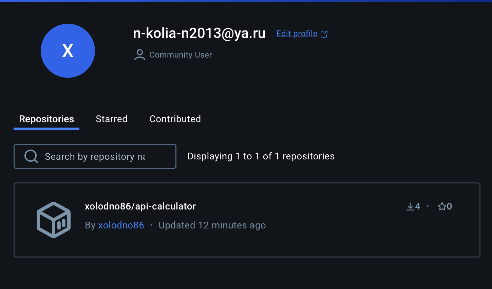
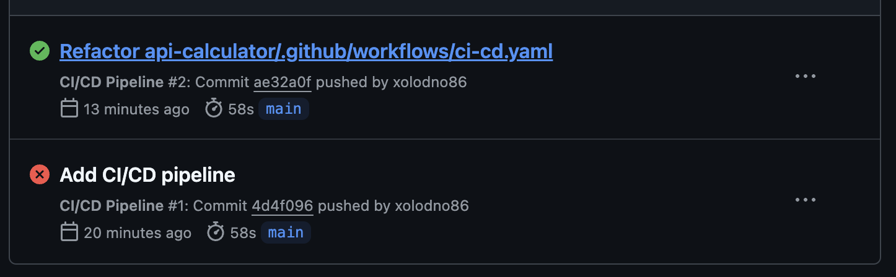

## **Анализ работы инструментов безопасности**

### **a. Обзор отчётов инструментов безопасности**

#### **Semgrep**

- **Версия:** Semgrep 1.36.0 на Python 3.11.4
- **Состояние сканирования:** Успешно завершено без обнаружения уязвимостей.
- **Результаты:**
  - **Найдено:** 0 проблем (0 блокирующих) из 149 правил.
  - **Вывод:** Код соответствует всем проверенным правилам безопасности и качеству кода. Дополнительные правила из Semgrep Registry не требуются, так как текущие настройки покрывают основные аспекты безопасности.

#### **Trivy**

- **Версия:** Trivy 0.57.1
- **Сканируемый образ:** `***/api-calculator:2.12712070407` на основе `debian 12.8`
- **Результаты:**
  - **Общее количество уязвимостей:** 6
    - **HIGH:** 5
    - **CRITICAL:** 1
  - **Детали уязвимостей:**

| Library            | Vulnerability | Severity | Status      | Installed Version | Fixed Version | Title                                                                                       |
|--------------------|---------------|----------|-------------|-------------------|---------------|---------------------------------------------------------------------------------------------|
| libgssapi-krb5-2   | CVE-2024-26462 | HIGH     | affected    | 1.20.1-2+deb12u2  | -             | krb5: Memory leak at /krb5/src/kdc/ndr.c                                                   |
| perl-base          | CVE-2023-31484 | HIGH     | affected    | 5.36.0-7+deb12u1  | -             | perl: CPAN.pm does not verify TLS certificates when downloading distributions over HTTPS...  |
| zlib1g             | CVE-2023-45853 | CRITICAL | will_not_fix| 1:1.2.13.dfsg-1   | -             | zlib: integer overflow and resultant heap-based buffer overflow in zipOpenNewFileInZip4_6     |
| setuptools (METADATA)| CVE-2024-6345 | HIGH     | fixed       | 65.5.1            | 70.0.0        | pypa/setuptools: Remote code execution via download functions in the package_index module...   |

### **b. Выявление слабых мест в коде и инфраструктуре**

#### **Semgrep**

- **Вывод:** Инструмент Semgrep не обнаружил никаких уязвимостей или нарушений стандартов кода. Это свидетельствует о том, что код API калькулятора написан с соблюдением лучших практик безопасности и качества.

#### **Trivy**

- **Уязвимости уровня HIGH и CRITICAL:**
  - **libgssapi-krb5-2 (CVE-2024-26462):** Уязвимость, связанная с утечкой памяти в компоненте Kerberos (`krb5`). Хотя это не прямая угроза для приложения, она может быть использована злоумышленниками для проведения атак типа Denial of Service (DoS).
  
  - **perl-base (CVE-2023-31484):** Уязвимость, связанная с тем, что модуль CPAN.pm не проверяет сертификаты TLS при загрузке дистрибутивов по HTTPS. Это может привести к атаке типа Man-in-the-Middle (MitM), позволяя злоумышленникам подменить загружаемые пакеты.
  
  - **zlib1g (CVE-2023-45853):** Критическая уязвимость, связанная с целочисленным переполнением и последующим переполнением буфера в функции `zipOpenNewFileInZip4_6`. Это может привести к выполнению произвольного кода или повреждению данных.
  
  - **setuptools (METADATA) (CVE-2024-6345):** Высокая уязвимость, позволяющая удалённое выполнение кода через функции загрузки в модуле `package_index`. Однако данная уязвимость уже исправлена в версии 70.0.0.

### **e. Заключение**

Анализ результатов сканирования показал, что хотя инструмент Semgrep не выявил уязвимостей в коде, Trivy обнаружил несколько критических и высоких уязвимостей в системных пакетах Docker-образа. Для повышения безопасности приложения рекомендуется:

- Обновить уязвимые зависимости до безопасных версий.
- Перейти на более лёгкий и безопасный базовый образ Docker (например, Alpine).
- Минимизировать количество предустановленных пакетов, удаляя ненужные компоненты.
- Внедрить дополнительные меры безопасности, такие как мониторинг, логирование и сканирование секретов.

